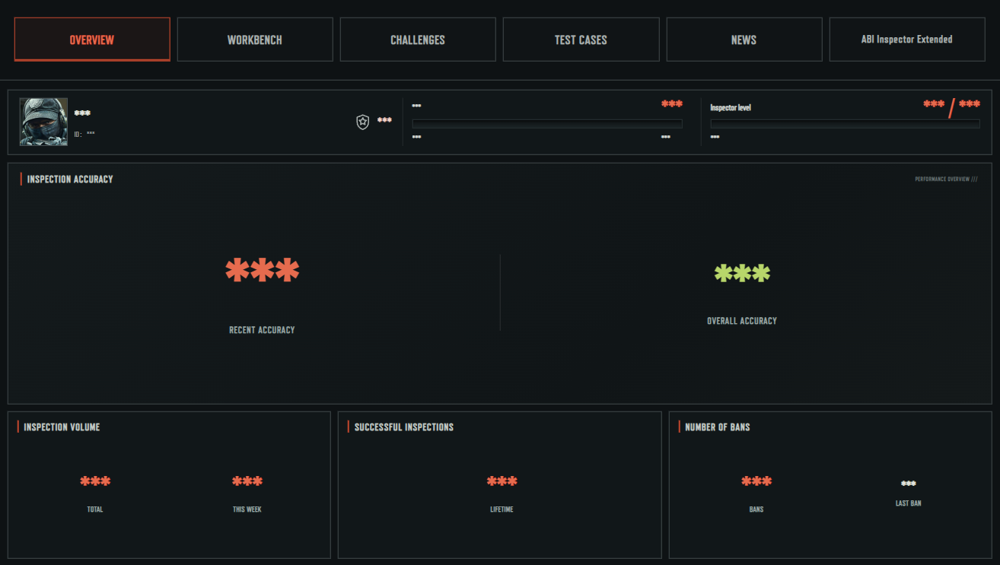
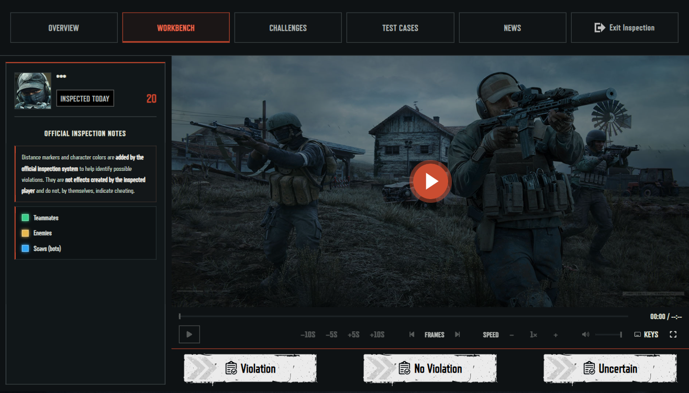
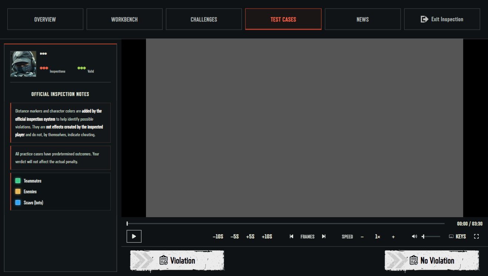
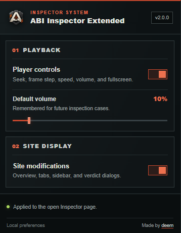
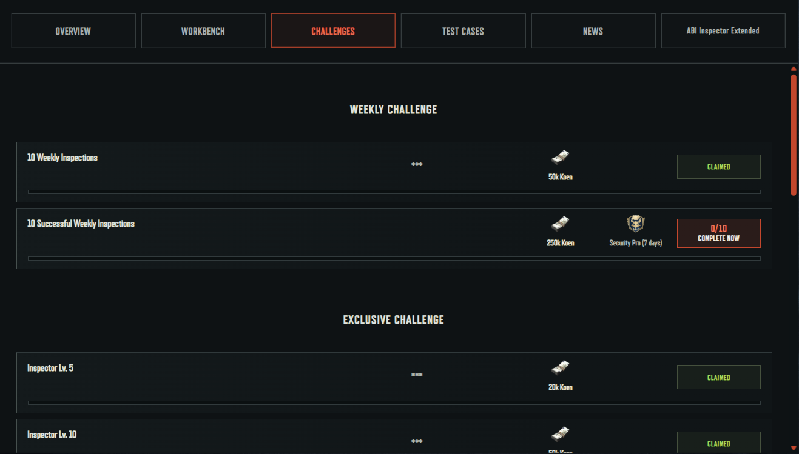
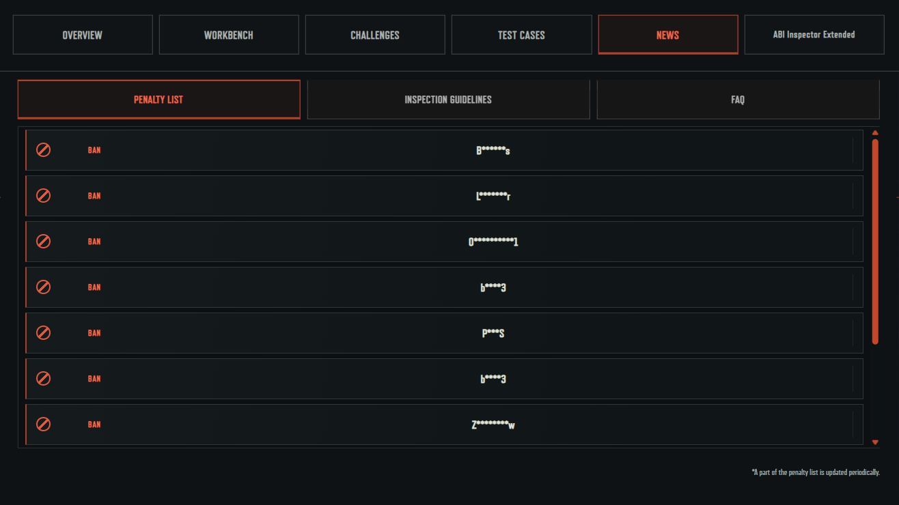
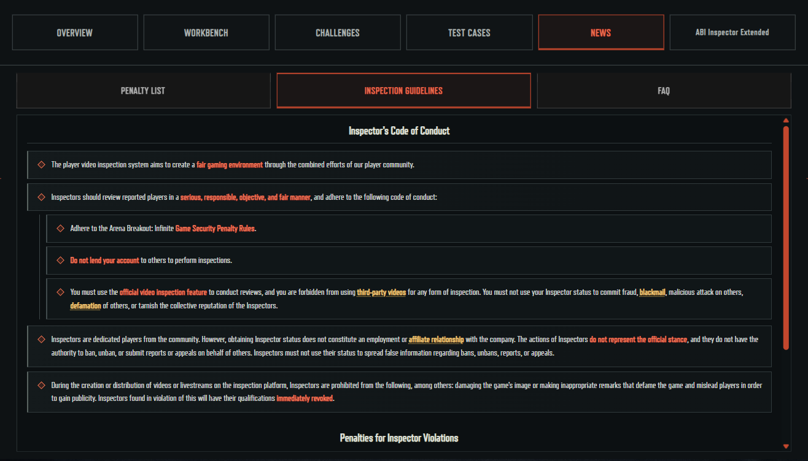
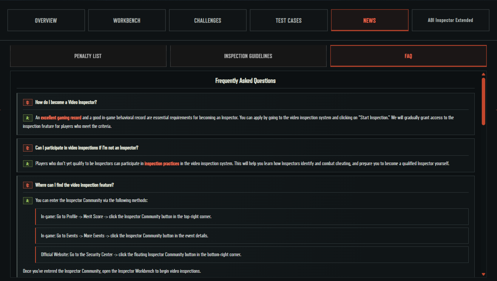
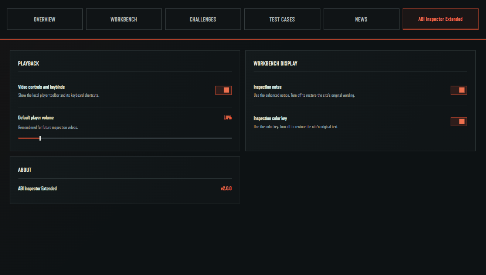

# ABI Inspector Extended

**Version 2.0.0** · A local interface enhancement for the official Arena Breakout: Infinite Inspector.

ABI Inspector Extended improves the Inspector experience with a redesigned overview, a consistent Workbench and Test Cases layout, video controls, and clearer challenge and News tabs. It leaves the official inspection flow and verdict actions in place.

> Independent community project. Not affiliated with or endorsed by the game’s publisher.

## Screenshots

All project screenshots live in [`screenshots/`](screenshots/). The Overview, Workbench, Test Cases, and Challenges captures use `***` to hide personal values.

### Overview and inspection

| Overview · Accuracy Board | Workbench · video controls |
| --- | --- |
|  |  |

| Test Cases | Extension popup |
| --- | --- |
|  |  |

### Challenges and News

| Challenges | Penalty List | Inspection Guidelines |
| --- | --- | --- |
|  |  |  |

| FAQ |
| --- |
|  |

### Settings

| In-site extension settings |
| --- | --- |
|  |

## Features

- **Accuracy Board overview:** profile, rank and level progress, inspection accuracy, volume, successful inspections, and ban statistics.
- **Screenshot anonymization:** the account toolbar can replace names, IDs, rank and level values, and statistics with `***` across tabs. **Unanonymize** restores the original values. The preference is remembered in this browser.
- **Workbench and Test Cases:** shared player controls and styling, official inspection notes, and the teammate, enemy, and Scav color key. Test Cases keeps its Inspections and Valid counters and native verdict buttons.
- **Challenges:** weekly and exclusive tasks in a single scrollable list, with progress, rewards, and the site’s existing claim and completion actions.
- **News:** horizontal subtab navigation for the Penalty List, Inspection Guidelines, and FAQ.
- **Video controls:** play and pause, seeking, approximate frame stepping, playback speed, volume, and fullscreen, with keyboard shortcuts.
- **Saved preferences:** player volume and display settings persist between cases and page reloads.
- **Extension settings:** control player tools, site modifications, and default volume from the extension popup. The in-site extension tab contains display settings and version information.
- **Restyled verdict dialogs:** clearer options and counters while retaining the site’s own form elements and behavior.

## Install

1. Download or clone this repository and keep it in a permanent folder.
2. Open `chrome://extensions` in Chrome or `edge://extensions` in Edge.
3. Turn on **Developer mode** and select **Load unpacked**.
4. Choose the `abi-inspector-enhancer` folder, which contains `manifest.json`.
5. Open or reload the Inspector page.

After changing extension files, reload the extension from the browser’s Extensions page, then refresh the Inspector tab. Disable or remove the extension and refresh the page to return to the original presentation.

The extension is scoped to the official Inspector page:

[`https://www.arenabreakoutinfinite.com/act/a20251028patroller/`](https://www.arenabreakoutinfinite.com/act/a20251028patroller/)

## Settings

Open the extension popup from the browser toolbar. **Player controls** and **Site modifications** can be toggled independently. Set the default player volume there; the value is remembered between cases and page reloads. Some layout changes require a page reload, and the popup offers a reload action when needed.

Use **Anonymize** in the account toolbar for screenshots. It masks the account name, ID, rank and level details, overview statistics, and visible inspection counters. Select **Unanonymize** to restore them.

## Keyboard shortcuts

Shortcuts apply while using the page or player. They are ignored while typing in form fields and while focus is on buttons, links, dialogs, or the extension’s sliders.

| Action | Shortcut |
| --- | --- |
| Play / pause | `Space` or `K` |
| Back / forward 5 seconds | `J` / `L` or `←` / `→` |
| Previous / next frame | `,` / `.` |
| Slow down / speed up | `[` / `]` |
| Reset speed to 1× | `\` or click the speed value |
| Mute / unmute | `M` |
| Fullscreen / exit fullscreen | `F` / `Esc` |

The toolbar also has buttons for 10-second seeking, volume, fullscreen, and other controls. Frame stepping seeks by approximately 1/30 second and may not match the video’s actual frame rate.

## Privacy and compatibility

The Manifest V3 extension declares the `storage` permission for preferences and saved player volume. Its content scripts are limited to the official Inspector page. It uses no external scripts, CDNs, analytics, or telemetry. It does not fetch or extract video URLs, modify or cover the video watermark, submit verdicts, or automate inspections. The official video, overlays, inspection controls, and verdict actions remain part of the page.

The controls require the official working player; training and drill players are intentionally excluded. Browser media behavior, the site’s own media limits, and future changes to the Inspector page can affect compatibility. Use a current version of Chrome or Edge.

## Source map

- `abi-inspector-enhancer/manifest.json` — extension configuration and page scope.
- `abi-inspector-enhancer/settings.js` and `popup.*` — preferences and popup interface.
- `abi-inspector-enhancer/content.js` and `player.css` — video controls and player layout.
- `abi-inspector-enhancer/layout.css` and `site-ui.js` — Overview, Workbench, Challenges, News, anonymization, and navigation styling.
- `abi-inspector-enhancer/dialogs.js` and `dialogs.css` — verdict-dialog presentation.
- `abi-inspector-enhancer/icons/` and `assets/` — browser icons and source artwork.
- `screenshots/` — current UI captures for the Overview, Workbench, Challenges, Test Cases, News, and settings.

## Credits

The project uses locally bundled [Font Awesome Free 6.7.2](https://fontawesome.com/license/free) icons under CC BY 4.0. Attribution and license details are in [`abi-inspector-enhancer/THIRD_PARTY_NOTICES.md`](abi-inspector-enhancer/THIRD_PARTY_NOTICES.md).

This is an independent interface enhancement. Use it in accordance with the applicable Inspector rules and terms.
