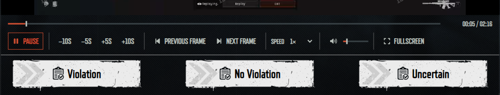

# ABI Inspector Extended

A focused Chrome and Edge extension for the **Arena Breakout: Infinite Inspector Workbench**. It replaces the default bottom video controls with a compact toolbar that uses the site's own typography and colors.

**Version 1.3.0 · Manifest V3 · No build step · No runtime network requests**

**Preview of the player**



**Preview of the player (Fullscreen)**


## Features

- **Fits the Workbench frame.** Video, toolbar, and the official **Violation / No Violation / Uncertain** buttons are stacked inside the site's video box, with no padding around the footage.
- **Three-zone toolbar.** Play on the left; seek, frame stepping, and speed centered; volume and fullscreen on the right. Play, mute, and fullscreen are icon-only, and the toolbar background is transparent so it blends into the site.
- Progress slider with elapsed / total time.
- Separate **−10s, −5s, +5s, and +10s** seek buttons.
- **◀ Frames ▶** stepping: pauses playback and steps approximately 1/30 second.
- **Speed stepper** (**SPEED − 1× +**) across nine speeds: **0.1×, 0.25×, 0.5×, 0.75×, 1×, 1.25×, 1.5×, 2×, and 3×**. The value turns accent-colored when it isn't 1×; click it to reset to 1×.
- Volume slider and an accessible mute/unmute icon.
- Fullscreen with the toolbar below the footage and no toolbar scrollbar.
- Local Font Awesome icons for playback, frame stepping, audio, and fullscreen.
- Keyboard shortcuts, visible focus states, and automatic reconnection when the official player changes cases.

## Layout

```text
[            official video (fills the remaining height)            ]
[ ━━━━━━━━━━━━━━━━━━━━━━ progress ━━━━━━━━━━━━━━━━━━━  00:10 / 01:28 ]
[▶]      −10s −5s +5s +10s   ◀ FRAMES ▶   SPEED − 1× +      🔊━━  ⛶
[ Violation ]        [ No Violation ]        [ Uncertain ]
```

- The Workbench box has a fixed height set by the site, so the video takes whatever height the toolbar and verdict row leave and letterboxes on black if needed. Because the site sizes in `rem` and the toolbar in pixels, the video gets shorter on small windows.
- When the toolbar is narrower than about 860px, the centered controls wrap onto their own row instead of squeezing.
- **Exit Inspection** stays in the site's tab bar; it is not moved.
- To line the video up with the painted frame lines, adjust the insets at the top of the `.play-box` rule in `player.css` (all default to `0`):

```css
--abi-box-top: 0rem;
--abi-box-right: 0rem;
--abi-box-bottom: 0rem;
```

## Installation

1. Clone this repository, or choose Code → Download ZIP on GitHub and extract the source.
2. Open `chrome://extensions` in Chrome or `edge://extensions` in Edge.
3. Enable **Developer mode**.
4. Click **Load unpacked** and select the **`abi-inspector-enhancer` folder**, which contains `manifest.json`. Do not select the repository root.
5. Open or reload the [official Inspector page](https://www.arenabreakoutinfinite.com/act/a20251028patroller/?lang=en).

The toolbar appears when the Workbench's working video player is present. It does not apply to the training player. Use a current Chrome or Edge version; Node.js is not required to install or use the extension.

### Updating or removing

Keep the unpacked folder in a permanent location. To update, replace its files, click **Reload** on the extension's browser card, and refresh the Inspector page. If you move the folder, remove the old browser entry and load the new folder.

To restore the original player, disable or remove the extension and refresh the page.

## Keyboard controls

| Key              | Action                     |
| ---------------- | -------------------------- |
| Space or K       | Play / pause               |
| J or Left arrow  | Back 5 seconds             |
| L or Right arrow | Forward 5 seconds          |
| Comma            | Previous approximate frame |
| Period           | Next approximate frame     |
| [ or ]           | Slower / faster            |
| \                | Reset speed to 1×          |
| M                | Mute / unmute              |
| F                | Enter / exit fullscreen    |
| Escape           | Exit fullscreen            |

Shortcuts are ignored while typing or when an input, slider, select, button, link, editable area, or dialog control has focus. Tab moves through the toolbar; Enter or Space activates a focused button. Button tooltips show their shortcuts.

Frame stepping is a **time-based approximation**, not a decoded-frame operation. A 1/30-second step may not correspond to exactly one source frame. Seeking becomes available after the official video reports a finite duration.

## Scope and privacy

The extension acts on the official video already loaded inside `#workingPlayer`. It does not read video addresses, download footage, replace the media source, analyze footage, or call case/account APIs. The official site still handles its own video loading; playback and seeking can cause its existing media pipeline to load data normally.

- **Watermarks are preserved.** The original video and watermark subtree stays together, including in fullscreen. The toolbar sits outside the footage.
- **Verdicts remain official.** Existing verdict buttons retain their nodes and behavior. The extension adjusts the surrounding layout but never clicks verdict buttons, submits decisions, or accesses submission logic.
- **Everything runs locally.** No telemetry, analytics, storage, background worker, remote scripts, or icon CDN. Settings are not persisted between page loads.
- **Access is narrowly scoped.** The manifest injects only on the official Inspector directory at `https://www.arenabreakoutinfinite.com/act/a20251028patroller/`. A runtime guard further limits it to that exact page and the top frame. No additional extension API permissions are requested; the browser can still show a site-access notice for the content script.

The native bottom toolbar is hidden only once the replacement is ready. Its elements and handlers remain intact. If a future player places a watermark inside that toolbar, the hiding rule leaves it visible.

This project is independent of Tencent and Arena Breakout: Infinite. It is not an official product, endorsement, or confirmation that browser extensions are permitted by the Inspector rules.

## Development

The extension is plain JavaScript and CSS. Edit the source, reload the unpacked extension in the browser, and refresh the target tab.

```text
abi-inspector-enhancer/
  manifest.json             Browser declaration and page scope
  content.js                Toolbar, media controls, and lifecycle handling
  player.css                Workbench layout (video / toolbar / verdict row) and fullscreen
  README.md                 Standalone installation guide
  THIRD_PARTY_NOTICES.md     Icon attribution
  FONT-AWESOME-LICENSE.txt   Upstream license notice
```

### Check the source

With Node.js 20 or newer, run from the repository root:

```sh
npm run check
```

This runs a syntax check (`node --check`) on `content.js`. There are no runtime dependencies and no build step. Test fixtures and generated builds are intentionally excluded from this public source tree, and no authenticated account, official footage, or captured case URLs are needed to work on the extension.

## Troubleshooting and contributions

**No toolbar:** reload the extension and page, check the exact Inspector address, and wait for the Workbench player to appear.

**Controls stop working after a site update:** compare with the extension disabled. A change to the site's player structure may require an extension update.

**Playback or seeking is rejected:** the extension reports the error locally. It does not switch sources or bypass site restrictions.

Bug reports and improvements are welcome. Include the browser version, extension version, steps to reproduce, and whether fullscreen is involved. Redact inspector IDs and account details from screenshots; do not include case footage, video URLs, or copied account data. Keep changes within the presentation/playback scope above.

## Credits

Icons: **[Font Awesome Free 6.7.2](https://fontawesome.com/)** by Fonticons, Inc., licensed under **CC BY 4.0**. Eight SVG paths are bundled locally; see [third-party notices](abi-inspector-enhancer/THIRD_PARTY_NOTICES.md) and the [upstream license](abi-inspector-enhancer/FONT-AWESOME-LICENSE.txt).

The site supplies its existing typeface and artwork. Those assets are not distributed in the extension.
