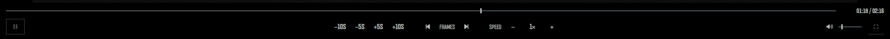

# ABI Inspector Extended

**Version 1.7.0** · A local interface enhancement for the official Arena Breakout: Infinite Inspector.

ABI Inspector Extended refreshes the Inspector’s Overview and Workbench interfaces and adds a configurable video-control toolbar. It keeps the official inspection page, video, and verdict workflow in place.

> Independent community project; not affiliated with or endorsed by the game’s publisher.

## Screenshots

All project screenshots are collected in [`screenshots/`](screenshots/).

| Overview · Accuracy Board | Workbench · video controls |
| --- | --- |
|  |  |

| Fullscreen player | Extension settings |
| --- | --- |
|  |  |

## Highlights

- **Accuracy Board overview:** inspector avatar and rank, rank and level progress, recent and overall accuracy, inspection volume, successful inspections, and ban statistics.
- **Workbench profile panel:** inspector identity and daily count, official inspection notes, a color key for teammates, enemies, and Scavs, and a video-key guide opened on demand.
- **Video controls:** playback, seeking, approximate frame stepping, speed, volume, and fullscreen controls, with keyboard shortcuts.
- **Persistent player volume:** the preferred volume is remembered across cases and page reloads.
- **Optional site styling:** enable or disable the site-interface changes and player controls independently from the extension popup.
- **Restyled verdict dialogs:** clearer option chips and character counters while retaining the site’s own form elements and behavior.

## Install

1. Download or clone this repository and keep it in a permanent folder.
2. Open `chrome://extensions` in Chrome or `edge://extensions` in Edge.
3. Turn on **Developer mode** and select **Load unpacked**.
4. Choose the `abi-inspector-enhancer` folder (the one containing `manifest.json`).
5. Open or reload the official Inspector page.

After changing extension files, choose **Reload** on its browser extensions card and reload the Inspector tab. Disable or remove the extension and reload the page to return to the original presentation.

The extension is scoped to the official Inspector page:

[`https://www.arenabreakoutinfinite.com/act/a20251028patroller/?lang=en`](https://www.arenabreakoutinfinite.com/act/a20251028patroller/?lang=en)

## Settings

Open the extension popup from the browser toolbar. **Player controls** and **Site modifications** are enabled by default and can be toggled separately. The popup also provides a **Player volume** setting; its value persists between cases and page reloads. Some layout changes require reloading the Inspector page, and the popup offers a reload action when needed.

## Keyboard shortcuts

Shortcuts apply while using the page or player. They are ignored while typing in form fields and while focus is on buttons, links, dialogs, or the extension’s sliders.

| Action | Shortcut |
| --- | --- |
| Play / pause | `Space` or `K` |
| Back / forward 5 seconds | `J` / `L` or `←` / `→` |
| Previous / next frame | `,` / `.` |
| Slow down / speed up | `[` / `]` |
| Reset speed to 1× | `\` or click the speed value |
| Mute / unmute | `M` |
| Fullscreen / exit fullscreen | `F` / `Esc` |

The toolbar also has buttons for 10-second seeking, volume, fullscreen, and other controls. Frame stepping seeks by approximately 1/30 second and may not match the video’s actual frame rate.

## How it works

The extension uses a Manifest V3 content script on the Inspector page and a small popup for settings. It operates on the official video in `#workingPlayer`; it does not fetch or extract video URLs. The official video, overlays, inspection controls, and verdict actions remain part of the page. The extension does not submit verdicts or automate inspections.

Only the `storage` permission is declared, for the popup preferences and saved player volume. There are no host permissions, external scripts, CDNs, analytics, or telemetry. The extension does not modify, hide, clone, or cover the video watermark. Browser keyboard and media behavior, the site’s own media limits, and future changes to the Inspector page can affect compatibility.

Use a current version of Chrome or Edge. The controls require the official working player; training and drill players are intentionally excluded. No authenticated live inspection was used for verification.

## Source map

The extension source is readable without a build step:

- `abi-inspector-enhancer/manifest.json` — extension configuration and page scope.
- `settings.js` and `popup.*` — saved preferences, volume, and popup interface.
- `content.js` and `player.css` — player controls, keyboard handling, and video layout.
- `layout.css` and `site-ui.js` — Overview, Workbench sidebar, and navigation styling.
- `dialogs.js` and `dialogs.css` — verdict-dialog presentation.
- `icons/` and `assets/` — browser icons and source artwork.
- `screenshots/` — all README screenshots.

## Credits

The project uses locally bundled [Font Awesome Free 6.7.2](https://fontawesome.com/license/free) icons under CC BY 4.0. Attribution and license details are in [`THIRD_PARTY_NOTICES.md`](abi-inspector-enhancer/THIRD_PARTY_NOTICES.md).

This project is an independent interface enhancement. Its technical scope does not establish permission under the Inspector’s rules; use it in accordance with the applicable terms.
